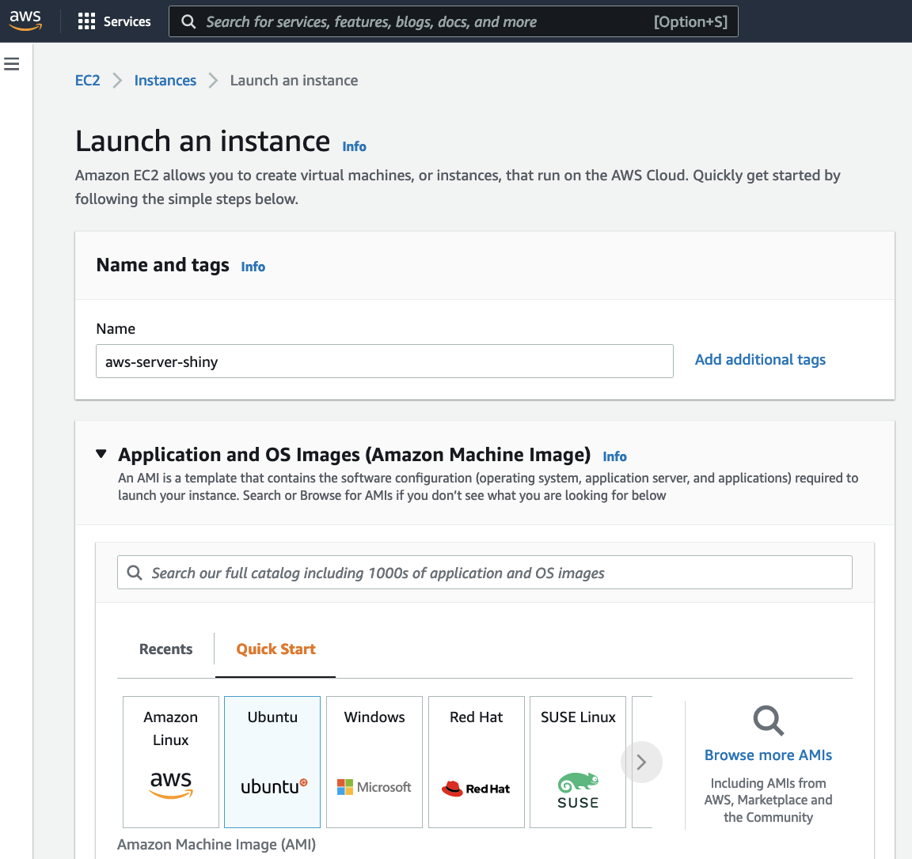
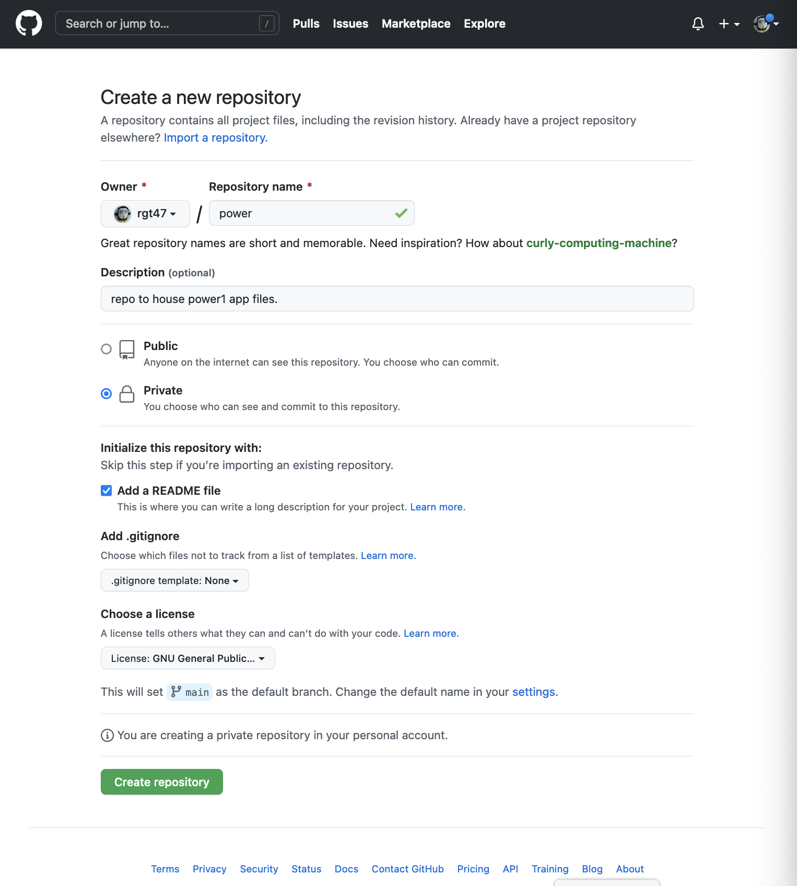

[go to appendix](#appendix1)


```{r init, include=FALSE}


options(dplyr.print_max = 1e9)
library(pacman)

p_load(jpeg, rmarkdown, tidyverse,  broom,  tidyr,  purrr,readr,
       dplyr,  lubridate, zoo,  ggplot2, printr, lsmeans, ggthemes,  knitr,
       nlme, pwr)

opts_chunk$set(warning = F, message = F, echo=F, fig.width=3.2,
	       fig.height=3,  results='asis', dev='pdf',
	       opts_chunk$set(cache.path = "cache/"))
source('~/shr/zz.tools.R')
options(scipen = 1, digits = 2)
```

```{r out.width = "300px"}
include_graphics("rshiny.png")

```

# Introduction

This is the first in a series of posts offering suggested strategies for
leveraging a set of open source  technologies to provide  solutions to one of
the central challenges in the practice of data science, i.e. how to effectively
communicate analysis results to clients and collaborators.  The group of
technologies (or stack) we'll employ is: linux, R, Shiny, Caddy, git, and
Docker. We'll make use of the cloud services github and AWS. 

This initial post provides a minimal, proof-of-concept example of applying these
technologies for the development and hosting of an interactive application for conducting
a statistical power analysis. 

We start with a simple, but hopefully useful, stand-alone shiny app and end with a secure
(encrypted  and authenticated) web site with a custom domain name hosting our
app.  

# Methods

Lets assume we're just
finished developing a 'shiny' new shiny app, named ``power0`` .

Power0 in this post can be shiny app. To provide a concrete example we've
created our own app. See the code for our power0 shiny app [here](#appendix1) in
appendix 1. 

A screenshot of the finished product shows a shiny app with a widget to select the
sample size and a visualization (2D plot) of the power as a function of the
standardized effect size: 

```{r out.width = "300px"}
include_graphics("shinyapppower0.png")
``` 

```{r, eval=F, echo=F}
Consider an app that is a balance of simple and functional -- one that calculates
the power for a 2-sample t-test as a function of the standardized effect size. 
re is our shiny app ``myapp.R``: 
ui <- fluidPage(
titlePanel("Power Calculator for Two Group Parallel Designs"),
sliderInput("N", "Total Sample Size:", min = 0, max = 300, value = 100),
plotOutput("plot"),
verbatimTextOutput("eff"))

server <- function(input, output, session) {
  delta = seq(0, 1.5,.05)
  pow = reactive(sapply(delta, function(x) power.t.test(input$N, d=x)$power ))
  eff =  renderText(power.t.test(input$N, power=.8)$d)
  output$plot <- renderPlot({
  plot(delta, pow(), cex=1.5, ylab="power")
  abline(h = .8,  col = "red", lwd =2.5, lty = 4)
  abline(v = eff(), col = "blue",lwd =2.5, lty = 4)})  
  output$eff <- renderText(
    paste0("Std. effect detectable with power 80% = ", eff()) )
}
shinyApp(ui, server)

``` Once we determine the app is working as designed.  We are interested in
hosting the app on a (virtual) server to allow others to share in its
utility. There are many ways to accomplish this. First off we'll
demonstrate one of the most straightforward and efficient: a docker based
approach. 

The first step is to dockerize (or more specifically a docker-compose) our app.
This provides a whole host of advantages. Lets discuss. 

```{r out.width = "300px"}
include_graphics("docker1.jpg")
```
<font size="2"> 
Photo by <a href="https://unsplash.com/@carrier_lost?utm_source=unsplash&utm_medium=referral&utm_content=creditCopyText">Ian Taylor</a> on <a href="https://unsplash.com/?utm_source=unsplash&utm_medium=referral&utm_content=creditCopyText">Unsplash</a>
</font> 


# Hosting

Once we have a production ready dockerized shiny app available, we'll want to
host it on the internet. To do that we'll need the following :

1. a virtual server (connected via ssh)
2. a static IP address
2. a domain name
2. a web server
3. an SSL certificate (encrypted communication)
4. an authentication method (password protection)
5. a reverse proxy method
5. a containerized version of app. 
6. a method for power0 container to communicate with containerized web-server.

Let's walk through each of these items. 

This can all be done at no cost if you have your own (self-hosted) server and
domain name, or at minimal cost using a cloud-hosting service (e.g. Amazon's EC2
or Digital Ocean) and a "leased" domain name from, e.g. GoDaddy, or Amazon's
Route 53. 

There are a number of cloud based server options: Microsoft Azure, Google Cloud,
Amazon AWS, Digital Ocean to name a few. Each has their own approach to setting
up a custom virtual server. 


Install docker and git.

Specific instructions for AWS EC2 are [here](#appendix2) in appendix 2.

Once the hosting process is complete items 1, 2, and 3 will be taken care of. 

# Web-site


To construct the web site we need three files to go along with our shiny app in
the home directory for default user ubuntu. 

* a Caddyfile
* a Dockerfile
* a docker-compose.yml file

Lets discuss each and add them to the power0 repo on our workstation. 
Once the files are present in the repo we can push copies to github and from there
we can access them from our server.

We'll use Caddy as our web server. Caddy is an open-source tool that has the
awesome feature of allowing  automating of, acquiring and installing an SSL
certificate, one of the most complicated parts of this exercise. 

Caddy is configures with a file named  `Caddyfile` configuration file. The
caddyfile provides three things.  We can accomplish what we need for items 4, 5
and 6 through the Caddyfile. 

First we provide with our servers domain name,e.g rgtlab.org and that is
sufficient to initiate an exchange with `letsencrypt` with the goal of
generating an SSL certificate. 

1. the site domain name. 
2. the authentication pair login/hash-password, and 
3. the 'reverse proxy' map that
   redirects requests to port 443 (ssl port) to port 3838 (shiny port). 

The Caddyfile is 


auth info bob/utter

```sh
rgtlab.org {
basicauth * {
		bob JDJhJDE0JElCQmRGaTA0ajY3bkZTLjRiWUZ4enVoZnVSQzVXVGVUMHlVcXJTaTRGYmpRQVFHLnYzN0tx
	}
	handle_path /power0/* {
		reverse_proxy power0:3838
	}
}

```
And the third file is the docker compose file that pulls our shiny app, and the
caddy server and create a local network for them to communicate in.

docker-compose.yml

```sh

version: "3.7"

services:
  power0:
    build: .
  caddy:
    image: caddy:2.3.0-alpine
    ports:
      - "443:443"
    volumes:
      - $PWD/Caddyfile:/etc/caddy/Caddyfile
      - caddy_data:/data
volumes:
    caddy_data:
```

Here is our dockerfile: 

```{r, eval=F, echo=T}

FROM rocker/shiny:4.2.0
COPY app.R /srv/shiny-server/
USER shiny
CMD ["/usr/bin/shiny-server"]

```


to add authentication to the web site use basic auth supplied by caddy
first to get access to the command line interface (CLI) for caddy issue the
docker command to load a caddy container from Docker Hub
```sh	
docker-compose run caddy caddy hash-password


docker run -it --rm caddy:2.3.0-alpine /bin/sh
caddy hash-password --plaintext bar
```

Thats it. With the dockerfile and the app.R fine in the same directory we can
first build the docker image, and then push it to Docker hub as a convenient
repository. (Alternatively we could copy it directly to the server or to another
site, e.g github.com. )

Details are [ here ](file)

Lets clone them into the server from github. 

```sh
git clone https:// ???
```

# Appendix1 

Pull the power.R file from rgt47 gist

```sh

ui <- fluidPage(
titlePanel("Power Calculator for Two Group Parallel Designs"),
sliderInput("N", "Total Sample Size:", min = 0, max = 300, value = 100),
plotOutput("plot"),
verbatimTextOutput("eff"))

server <- function(input, output, session) {
  delta = seq(0, 1.5,.05)
  pow = reactive(sapply(delta, function(x) power.t.test(input$N, d=x)$power ))
  eff =  renderText(power.t.test(input$N, power=.8)$d)
  output$plot <- renderPlot({
  plot(delta, pow(), cex=1.5, ylab="power")
  abline(h = .8,  col = "red", lwd =2.5, lty = 4)
  abline(v = eff(), col = "blue",lwd =2.5, lty = 4)})  
  output$eff <- renderText(
    paste0("Std. effect detectable with power 80% = ", eff()) )
}
shinyApp(ui, server)

```

# Appendix2 


AWS is a reasonable choice for setting up a small custom server. AWS offers a
free set of servers for the first 12 months. 


To start open EC2 console. 
```sh
   https://aws.amazon.com/console
```

```{r out.width = "300px"}


```

Create an account or sign in then before choosing the server template set up a
working environment. Specifically you'll want to set up four components of the environment

1. ssh key pair
1. firewall 
1. Domain Name 
1. Static IP
  
1. 

The first time you create an AWS account you need to exchange an SSH key pair
with AWS.
You can generate an ssh key pair locally and upload public key to EC2. 
Create a directory to hold the keys. e.g. ~/.ssh.
From inside .ssh generate the keys with the command

```sh
sh> ssh-keygen -m PEM
```
name key prefix something like `ssh-rsa`.

Back On EC2 select security/keys and  import the public key.

Construct a `config` file in `~/.ssh` as:
```sh
Host ec2
    HostName 13.57.139.31 # static IP
    User ubuntu # default user on ubuntu server
    Port 22  # the default port ssh uses
    IdentityFile ~/.ssh/ssh-rsa.pem
```
then you can ssh into new server with 
```sh
sh> ssh ec2
```


Use elastic IP (to allow server to be run "on-demand")
     * click on elastic IP in left panel
     * select associate Elastic IP  13.57.139.31
  choose an instance (shiny-july22) to associate with. 

* side panel, click "ec2"
* side panel, click "Instances"
* from top bar, click "Launch Instances"

2. From "Quick Start" click Ubuntu button. 
* Name the server say shiny-july22
*      Choose an AMI (instance template, operating system):

Suggest choose "Ubuntu Server 22.04 LTS", but other linux distributions can be utilized, e.g.u 
Red Hat, or SUSE.)

e.g. ubuntu/images/hvm-ssd/ubuntu-jammy-22.04-amd64-server-20220609

3. Next choose an instance **type**, e.g. "t2-micro". (different instances are
   mixtures of size, processors, memory, instance storage, network performance) 
click "Next: Configure Instance Details"

*. choose Key pair (use in place aws18.pem) or set up new pair


Add security group, e.g. 'shiny' (sg-0f37c94ac1e1b6250) 
allowing ports 80 (http), 22 (ssh), 443 (https), and 3838 (shiny). 
and 8787 

choose  30 GB of EBS General Purpose (SSD) or Magnetic storage   

click Launch Instance


Use elastic IP (to allow server to be run "on-demand")
* click on elastic IP in left panel
* select associate Elastic IP  13.57.139.31
  choose an instance (shiny-july22) to associate with. 

Log into new instance with ssh from local

```sh
ssh -i ~/.ssh/aws18.pem ubuntu@13.57.139.31
```
or 
```sh
ssh ec2 

```
if you've set up a ``config`` file in ``~/.ssh`` (see Tips at the end of the
blog)


set up the environment on server. There is only one piece of software to
install: Docker. 

```sh
apt-get -y update
apt-get -y upgrade

apt-get install -y \
    docker \
    docker-compose

systemctl enable docker
# or use homebrew for lin


```
Add ubuntu to the docker group

get domain name from Route 53. 

Go to godaddy or Amazon route 53 to associate a domain name with the Elastic IP
in EC2. 

(screenshot) 

To associate domain name rgtlab.org.
in Route 53: 

* click on 'hosted zones' in side panel
* click on rgtlab.org in center panel
* click on checkbox for rgtlab.org type=A line
* then click on edit record in right panel
* change ip address to 13.57.139.31


# appendix x (joe data version)

ok! got my shiny app running. Works great! Now how do I get it up on the web and
shared with my client Bob?  

Start by creating a repo for the app on github. 

* login to github (screenshot) 


```{r out.width = "300px"}


```


*  click  on `new` in `repo name` and enter `power1`. (Make the repo private we
  only want to share with Bob at this point). 
* create repo
* on workstation: clone the repo 
```sh
git clone https://github.com/rgt47/power1.git
```
* copy `power1.R` in `power1` repo directory. 
* update remote repo
    * git add . 
    * git commit -m 'add shiny code'
    * git push

Now we need a (virtual) server to host the app. Let use Amazon AWS. 

