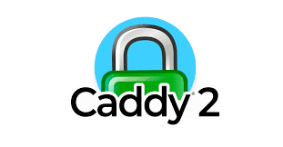

```{r init, include=FALSE}

options(dplyr.print_max = 1e9)
library(pacman)

p_load(rmarkdown, tidyverse,  broom,  tidyr,  purrr,readr,
       dplyr,  lubridate, zoo,  ggplot2, printr, lsmeans, ggthemes,  knitr,
       nlme, pwr)

opts_chunk$set(warning = F, message = F, echo=F, fig.width=3.2,
	       fig.height=3,  results='asis', dev='pdf')
source('~/shr/zz.tools.R')
options(scipen = 1, digits = 2)
``` 

# Introduction

Communicating the results of a data science analysis is an important part of the
exercise. My preference is at the conclusion of an analysis to "spin up" a small
virtual server on one of the cloud platforms and present the results dynamically
via the technologies: shiny, docker, and Caddy. 

This doesn't require a lot of coding but you do need to understand some key
aspects of the technology to perform this exercise quickly and effectively.  

This post discusses the essential components of the Caddy web server and offers
a primer on its configuration aimed at facilitating data science projects. 


